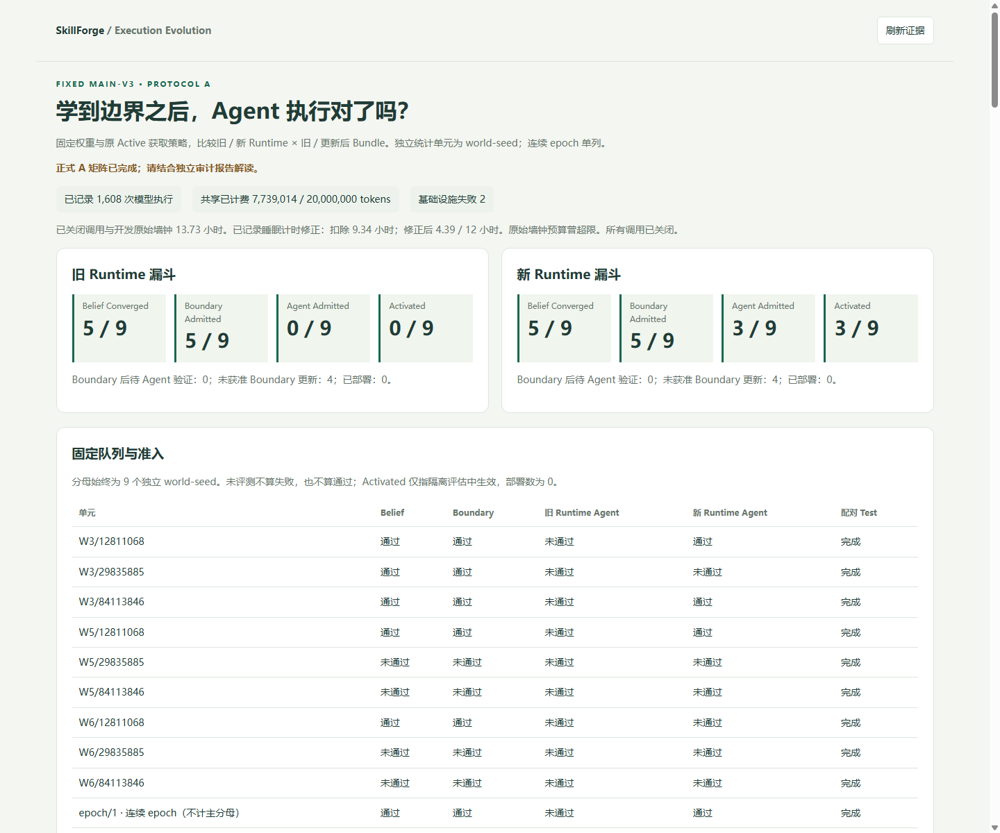

# Execution-Aware Self-Evolution v1.1 正式交付

更新：2026-10-06。A/B 的实现、正式实验、独立审计和只读网页已经完成。工程完成不等于研究假设全部通过。固定 main-v3 权重，未新增 SFT/DPO/RL，未部署实验 Bundle；Continual SFT 为条件触发的 v1.2 工作。

发布前独立源码副本回归：**279 passed、1 skipped**；10,699 个历史文件校验通过，源码副本与工作区无 Python 漂移。[验证回执](../results/active-evolution/v1.1/development/source-check-b694da098d164773ac03af48860a71d7/report.json)。最终桌面/手机预览无溢出、无 JavaScript 错误，A 退步和 B 查询轨迹跳转通过。

## A：Execution-Aware Runtime

9 个独立 world-seed、2 个连续 policy epoch，共 1,608 条真实模型执行（1,024 FullSystem、584 Decision）。293 个 VerificationReceipt、605 次 Runtime intervention；自主 EOC 与 Runtime 辅助 EOC 分开统计，不能把 Runtime 的修复解释为模型学会了正确执行。

固定分母 9：两种 Runtime 均为 5 Belief Converged → 5 Boundary Admitted；旧 Runtime 为 0 Agent Admitted → 0 Activated，新 Runtime 为 3 → 3。Activated 仅指隔离实验，实际部署为 0。

Changed-test Runtime effect 为 +0.2639，新 Runtime 下 Bundle effect 为 +0.0417；candidate interaction 为 +0.1111，effective interaction 为 +0.0417。拒绝提案后的 fallback 计入 effective 指标。统计单位为 world-seed。

独立实验 effective test 没有实际违规或 stable 退步；连续 epoch 2 出现 1 个 stable 退步，完整 retention 验收未通过。全部 64 对连续有效轨迹为 61 不变、2 改善、1 退步。退步是正确 refuse 变为 escalate，两边 Gate 均不适用且无 Runtime intervention，不是 Boundary false allow 或读回失败；模型非确定性未被排除。

- [正式 A 报告](../results/active-evolution/v1.1/formal-A-v2/REPORT.md)
- [A 验收及归因解读](EXECUTION_AWARE_A_ASSESSMENT.md)
- [最终 A 审计](../results/active-evolution/v1.1/formal-A-v2/audits/finalization-72b4dc3a119f4bff8ad355b6acd20fa3.json)
- [连续轨迹归因](../results/active-evolution/v1.1/formal-A-v2/posthoc/continual-attribution.json)

累计 7,739,014 tokens，包含失败调用预留。原始包含睡眠的墙钟为 13.733 小时；有 Windows 事件证据的睡眠修正后为 4.394/12 小时。修正是冻结后的基础设施记账偏离，不代表原始墙钟预算合规，也不是实测 GPU 利用时间。原账、失败调用及恢复证据全部保留。

## B：Active Acquisition v2

独立协议、6 worlds × 5 paired seeds × 5 methods，共 150/150 组；独立重放审计通过。B 是 CPU Boundary 实验，新增模型调用、tokens 与 GPU 时间均为 0。

| 方法 | 预算内收敛 | restricted mean queries | False allow | False block |
|---|---:|---:|---:|---:|
| no_adapt | 0/30 | 20 | 144 | 6 |
| passive | 0/30 | 20 | 144 | 6 |
| random | 2/30 | 19.6 | 129 | 6 |
| active | 23/30 | 8.8667 | 7 | 5 |
| active_v2 | 23/30 | 8.8667 | 7 | 5 |

所有方法实际违规及 stable 退步均为 0。Active v2 与原 Active 的配对差异均为 0；186 条 v2 查询中 H0 Challenge 未触发。不存在认证错误收敛，但 7 个未收敛且未准入的运行回退 H0 后仍产生 heldout 错误。因此联合效率点准则通过，heldout safety 和 H0 错误收敛改善要求未通过，`v2_research_claim_passed=false`。不能宣称 Challenge 有效或将这些 CPU 数字当作真实 Agent 改善。

- [正式 B 报告](../results/active-evolution/v1.1/formal-B-v1/REPORT.md)
- [B 结构化结果](../results/active-evolution/v1.1/formal-B-v1/cpu-report.json)
- [B 独立审计](../results/active-evolution/v1.1/formal-B-v1/audits/evidence.json)
- [运行、开发选择与审计边界](ACQUISITION_V2_RUNNING.md)

## 网页预览与复现

安装项目依赖并拉取 Git LFS 后，在仓库根目录运行：

```powershell
python -m pip install -e ".[dev]"
git lfs pull
python -m uvicorn scripts.execution_delivery_workbench:app --host 127.0.0.1 --port 8091
```

打开 http://127.0.0.1:8091/ 。该页面只读、不调用模型，展示四层漏斗、Runtime 归因、VerificationReceipt、连续退步跳转、B 联合验收和查询轨迹。此地址是本机预览，不是已部署的公共网站。



[手机截图](../results/active-evolution/v1.1/development/workbench-qa-AB-final/mobile.png) · [B 查询截图](../results/active-evolution/v1.1/development/workbench-qa-AB-final/acquisition.png) · [浏览器验收回执](../results/active-evolution/v1.1/development/workbench-qa-AB-final/browser.json)

冻结 A/B 源码、原始 JSON 证据、SQLite 探针、失败记录、恢复证据和正式报告均随仓库归档。SQLite 使用现有 Git LFS；机器环境、凭据、PID 和缓存不发布。历史版本和失败结论保留，不能混合不同协议的分母。
