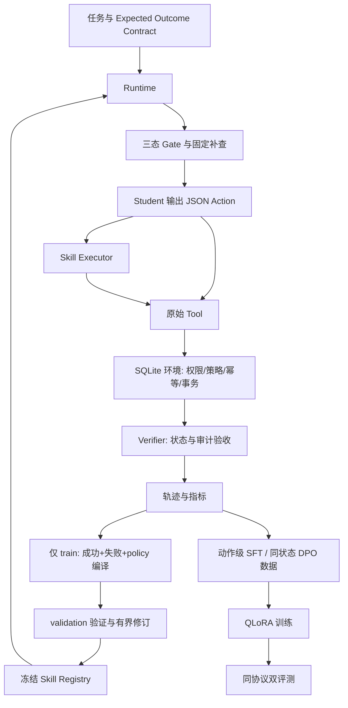

# SkillForge 项目复盘与面试追问手册

更新时间：2026-09-17。本文依据当前源码、已保存的轨迹和训练结果编写。文中的执行示例用于解释机制，不冒充某次真实模型输出；实验数字均另列证据路径。后续评测完成后应补充结果，不能把本文的待办当作已完成工作。

**16:38续跑更新**：下文记述的scripts模块导入故障已修复，流水线实际进入Base-validation并逐任务保存；源码独立回归现为90 passed、1 skipped。三次稳定性子集已在新test之前预声明，结果尚未完成。新增[研究报告](RESEARCH_REPORT.md)包含实际基线与训练曲线；旧“中断”描述保留为排障trace，不代表当前仍停机。

## 1. 一分钟介绍项目

SkillForge 是一个研究“如何把 Agent 的工具调用经验变成可执行技能，并教会模型正确选择技能”的本地研究系统。

我选择了订单改地址、取消订单和退款这些有明确状态与业务规则的任务。模型既可以调用原始工具，也可以调用由多步操作组成的 Skill。Skill 不只是提示词，而是包含输入、适用条件、禁止条件、执行步骤和后置条件的有限契约。系统根据成功轨迹、失败轨迹和业务策略生成边界，通过验证后冻结版本。

工程上，我实现了隔离的 SQLite 业务环境、事务内权限与策略校验、写工具幂等、三态适用性判断、持久化工作台和完整执行审计。研究上，先完成真实模型 B0–B3 和去 Gate 对照，再构建动作级 SFT 与同上下文 DPO 数据，在本机 RTX 5070 上训练 Qwen3-4B 的 QLoRA 适配器。

当前正式 SFT 和 DPO 都已完成并保存真实权重；训练后的独立评测尚未完成。已有基线揭示了一个关键问题：模型即使看到 Skill，也未必会主动调用。因此，我没有把系统跑通当成技能学习有效，而是把“执行安全”“模型选择正确”和“最终业务结局正确”分别评估。

## 2. 当前到底完成了什么

| 部分 | 已有结果 | 面试时的准确表述 |
|---|---|---|
| 环境与执行 | 三类核心业务、工具校验、故障注入、事务、幂等、审计 | 已有可执行闭环，不只是架构图 |
| Skill | 地址、取消、退款三类冻结契约 | 有限领域编译，不是通用自动程序生成 |
| 数据集 | 216 个任务：69 train、69 validation、78 test | 有实例、模板内容和部分结构隔离；仍是合成环境 |
| 真实基线 | 五组各 78 个系统任务，共 390 次任务执行 | 已有真实模型结果，包括负结果 |
| 工作台 | 持久队列、历史、事件、取消、重试、轨迹和数据库下载 | 单用户本地研究服务，未宣称生产级多租户 |
| 网页验收 | 6 个真实模型网页案例通过 | 使用受限目录协议，不能混入自由 Action 对照 |
| SFT | 355 个动作样本，2 个 epoch，最终 90 个 optimizer steps | 正式适配器已生成，权重发生实际变化 |
| DPO | 90 对偏好，1 个 epoch，12 个 optimizer steps | 正式适配器已生成，权重发生实际变化 |
| 后训练评测 | 已实现双评测、恢复和报告流程 | 尚未完成，不宣称 SFT/DPO 提升 |
| 测试 | 最近源码独立回归 84 passed、1 skipped | 普通环境无 torch 导致跳过；GPU另有实测 |
| 发布 | 有打包审核脚本 | 最终发布包、私有模型上线及完整验收尚未完成 |

当前中断：`results/training/main-v2/logs/Base-validation-1789590850.log` 显示 `ModuleNotFoundError: No module named 'scripts'`。这是评测入口的模块启动问题，发生在模型评测开始前，不是模型能力失败，也不需要重新训练。

正式结果证据：

- `results/training/main-v2/sft/result.json`：completed，非 smoke，global_step=90，继承 step 10 后完成 80 次新更新，adapter_updated=true。
- `results/training/main-v2/dpo/result.json`：completed，非 smoke，global_step=12，adapter_updated=true。
- SFT 适配器：`results/training/main-v2/sft/adapter/adapter_model.safetensors`。
- DPO 适配器：`results/training/main-v2/dpo/adapter/adapter_model.safetensors`。
- 这些是 LoRA 适配器，需要配合固定版本基座模型，不是独立的完整 4B 模型文件。

## 3. 为什么做这个项目

普通 Tool-Use Agent 每次从头规划，相同业务流程会重复消耗模型决策，并可能遗漏检查。简单保存成功轨迹也有问题：某次改地址成功，只说明当时状态允许，不能证明发货后也能改地址。

因此需要回答三个独立问题：

1. 能不能把经验变成可执行、能检查结果的过程？对应 Skill Contract 和 executor。
2. 能不能知道经验什么时候不能复用？对应成功＋失败＋policy 的边界学习和 Gate。
3. 模型能不能学会选择正确技能、拒绝或转人工？对应真实对照、SFT、DPO 和 Decision-level 评测。

这三个问题不能合并。一个安全的工具环境可以拦住错误模型；一个强约束菜单可以让任务完成；这些都不自动证明模型学到了自主决策。

## 4. 系统架构与各模块职责



| 模块 | 代码 | 为什么这样划分 |
|---|---|---|
| 数据结构 | `skillforge/schemas.py` | Action、Task、契约等先结构化，拒绝额外字段，减少隐含协议 |
| 业务策略 | `skillforge/policies.py` | 集中定义业务允许性，避免提示词成为唯一安全边界 |
| 工具环境 | `skillforge/environment.py` | 状态修改必须落在可审计事务内 |
| 技能 | `skillforge/skills.py` | 判断、补查、绑定、执行、编译各有明确边界 |
| Agent循环 | `skillforge/runtime.py` | 负责模型上下文、动作分发、预算与轨迹，不让 Gate 自主规划 |
| 结果验收 | `skillforge/verifier.py` | 根据最终状态和证据验收，不信模型口头完成 |
| 数据隔离 | `skillforge/dataset.py`、`provenance.py` | 防止改 split 标签伪装合法来源 |
| 学习数据 | `learning.py`、`supervision.py`、`training_data.py` | 分离样本构造、执行证据与训练入口审核 |
| 训练 | `skillforge/training.py` | 固定数据、配置、基座与恢复身份 |
| 推理 | `model.py`、`hf_model.py`、`hf_server.py` | 隔离不同服务协议，并绑定实际模型版本 |
| 工作台 | `jobs.py`、`workbench.py`、`api.py` | 用户任务有持久生命周期，不依赖内存后台回调 |

Student 指负责输出动作的模型服务。它不是另一个自动学习进程，也不是人工客服。Runtime 发上下文，Student 回 `tool/skill/stop/refuse/escalate`，真正的数据库操作由环境执行。

## 5. 一次正常任务的完整 trace

下面用“将尚未发货订单改到新地址”解释调用链。订单 ID 和地址是示意值。

### 5.1 输入与隐藏信息

Task 包含请求、身份、业务参数、初始 fixture、split，以及 Expected Outcome Contract。模型可以看到请求、参数、已观察状态和公开 policy；不能直接看到验收 oracle 或完整隐藏数据库快照。

Runtime 记录 initial_state 是为了审计，不等于把 initial_state 全量塞给模型。模型观察从空字典开始，通过工具或 Gate 固定补查获得。

### 5.2 Gate 判断与补查

改地址 Skill 需要订单状态、物流状态、风险等级和地址有效性。刚开始信息缺失，Gate 返回 UNKNOWN，并列出 missing_fields。

Runtime 调用固定映射的读取工具，例如 get_order、get_shipment、get_customer、validate_address。补查不是 LLM 生成计划；Gate 本身没有 I/O。再次判断满足条件后，Skill 才进入 verified 模式的可执行候选。

### 5.3 模型选择

模型看到工具定义、已观察状态、公开 policy、历史和候选契约，输出类似：

```json
{"type":"skill","name":"modify_unfulfilled_order_address","arguments":{"order_id":"O-example","new_address":"100 Orchard Road, City"}}
```

这只是合法动作的示例。真实基线中模型经常仍选择 primitive tool；系统不能偷偷改写它的动作以制造 Skill 调用成功。

Runtime 检查 Skill 存在、当前可执行，并检查输入绑定与任务参数一致。模型不能借技能调用替换订单或退款金额。

### 5.4 Executor 执行

Skill 按有限 procedure 执行：读订单 → 读物流 → 验地址 → 写地址 → 读订单复核 → finish。每一步仍走相同 Tool 环境。

注意 Gate 补查和 Skill 内部读取可能重复。当前实现优先保证观察和执行证据完整，没有把这些成本隐藏；不能只数模型调用次数，就宣称所有成本都下降。

### 5.5 验收

Skill 检查 postconditions 后返回执行回执，但 Runtime 仍需模型选择 stop 结束任务。最终 verifier 检查：地址是否等于目标、订单状态及退款额等受保护字段是否未变、写入之后是否读取验证、是否发生实际违规。

模型输出 stop 只意味着声明 completed，绝不直接意味着 `verification.task_success=true`。

### 5.6 轨迹保存了什么

轨迹包含 task_hash、模型设置、精确模型可见 context、每步 action、工具参数与结果、前后状态差异、Skill 内部事件、最终 verdict，以及 tool/LLM/token/latency/Gate 成本。模型上下文和完整审计快照分开保存，既方便复现，也能检查是否泄漏 oracle。

## 6. Skill Contract 为什么要可执行且受限

契约主要字段：inputs、preconditions、forbidden_conditions、procedure、postconditions、policy_version、source_trajectory_ids、version 和 status。

当前 DSL 只有 call、assert、finish，procedure 最多 12 节点。条件只支持 eq/in；参数引用限于 `$input.*` 和 `$state.*` 等既定机制。退款剩余额这种领域关系由固定谓词计算，不开放任意表达式执行。

这样做的理由：

1. 自然语言经验无法稳定验收“是否真的执行了必要步骤”。
2. 通用 Python 或任意 DSL 会扩大安全、终止性、验证和版本兼容问题。
3. 有限 DSL 能明确检查工具白名单、输入绑定、步骤上限与后置条件。

当前编译器是 bounded domain compiler：依据预先支持的三类领域结构检查证据并生成契约。它不是自动发现任意算法，也没有实现递归技能组合。面试中主动说明这一点比把规则编译包装成开放域智能更可靠。

## 7. 三态 Applicability 与 UNKNOWN 成本

| 状态 | 含义 | 行为 |
|---|---|---|
| APPLICABLE | 当前已知信息满足前置条件且不触犯禁止条件 | verified 模式可进入候选 |
| INAPPLICABLE | 已知某个条件不满足或命中禁止条件 | 不允许直接执行 |
| UNKNOWN | 缺少必要观察，尚不能判定 | Runtime 有界补查；仍未知则不放行 |

缺字段不等于字段值为 False，也不等于业务上已观察到某个名为 UNKNOWN 的状态。比如没读物流不能当成“尚未发货”。

Gate 首先能利用已知禁止条件直接拒绝；不必为了已确定不可用的技能补齐所有字段。缺失信息补查有固定工具映射和重试预算，不会演化成一个新的 Agent。

UNKNOWN 成本计入真实工具审计和 `gate_tool_calls`，延迟计入整条 Runtime 耗时。另有 unknown_applicability_attempts/rate 记录未知状态下的技能尝试。两者不同：前者是补查成本，后者是调用行为统计。

局限：当前没有把每次 Gate 三态变化都汇总成独立完整时间序列指标，也没有跨进程统一的观测缓存。不能将已有指标描述为所有可能的 UNKNOWN 成本分析都已完成。

## 8. 为什么 Tool 里面还要二次 policy check

Gate 只是基于观察做准入，观察可能过期；模型也可能绕过 Skill 直接调用工具。真正状态变更必须由 Tool 自己授权。

工具流程是：校验工具名与参数 → `BEGIN IMMEDIATE` → 读取当前状态 → 校验订单所属身份 → 检查幂等键和参数签名 → 对新 mutation 执行业务 policy → 修改状态并写幂等记录 → COMMIT。

这解决了检查与使用之间状态变化的风险，也避免把提示词遵守情况当成权限系统。身份由 Runtime 固定提供，不接受模型在参数里自报身份。

缓存命中的 mutation 是读取既有操作结果，不是再次产生业务修改。因此同键同参重试不会重新退款；身份仍先校验，同键异参拒绝。不能笼统地说“每次缓存返回都重新执行业务 mutation 检查”。

## 9. 幂等性、响应丢失与取消

最典型的故障：退款已经 COMMIT，但客户端没收到响应。如果直接重试新请求，会重复退款；如果直接认定失败，又与数据库事实不一致。

当前使用任务内稳定的 mutation 身份：trajectory_id 加工具名和参数摘要。Skill 调用与 primitive fallback 的相同写入复用同一个操作身份。

第一次执行同时保存业务结果和幂等记录；响应丢失被模拟成提交后的 timeout。有限重试命中缓存，返回原结果，不新增退款账目。相同键但参数不同返回 idempotency_conflict。

这提供当前单数据库范围的幂等效果，不是跨支付网关、消息队列的通用 exactly-once 保证。若接真实支付系统，还需要外部幂等键、对账、状态机和恢复流程。

取消语义也必须精确：模型返回后、下一动作及工具执行前检查取消；已 COMMIT 的退款不回滚。取消之后保存真实状态，而不是向用户虚报“什么都没发生”。

## 10. Expected Outcome Contract：正确拒绝不等于随便拒绝

验收契约显式规定 allowed_outcomes、expected_state、unchanged_fields、require_verification。

- 正常改地址：允许 completed，地址必须变化到目标，其余关键字段受保护。
- 已发货改地址：预期 refused，不能通过改地址得到“完成”。
- 高风险订单：预期 escalated，必须实际新增人工工单，仅输出“请找人工”不够。
- 退款：还检查退款账目、transaction_id、金额增量与累计金额一致，不能只改一个汇总数字。

代码历史字段名仍叫 task_success，但含义是“满足这条任务的 Expected Outcome Contract”。它不是“业务写操作完成率”。报告必须同时展示 observed outcome 和各 outcome 下合格数量，避免把正确拒绝、正确转人工与写入成功混为一谈。

Verifier 不让模型自己打分。任务 oracle 来自显式场景定义；实际违规判定仍复用了业务 eligibility 实现，因此也存在共享实现错误的风险。当前通过固定预期场景与故障测试降低风险，不能声称形式化证明了 policy 正确。

## 11. 模型违规尝试与环境实际违规为什么分开

模型可能试图操作他人的订单，但工具权限检查成功拦截。此时模型决策有问题，环境没有产生实际非法修改。

最近又发现自动 Gate 补查的权限失败也会进入旧的总 attempted_policy_violation。为了避免把自动流程归因给模型，Runtime 新增 decision_origin 和 policy_attempts：

- 模型选择的 tool/skill 触发的违规尝试。
- 模型调用已知不适用 Skill 而被拦截的尝试。
- 自动 Gate 读取触发的权限/策略拒绝。
- 数据库实际发生的违规状态变更。

旧轨迹没有这些新归因字段，不能凭空重算成同口径。旧总尝试率保留，新模型归因指标在证据不足时返回 null。

面试关键回答：实际违规为 0 证明当前这些任务中环境防线没有放过违规修改；不证明模型理解了边界，更不证明任意攻击下都安全。

## 12. Skill Boundary 怎么学：三类证据缺一不可

只从成功轨迹抽象，会把相关性误当成适用条件。例如成功退款时恰好未发货，不能推导出“退款必须未发货”。

当前 verified compiler：

1. 只接收 train，检查 policy 版本和来源绑定。
2. 对每个领域至少要求 3 个不同成功轨迹，以及失败轨迹。
3. 成功必须是完成实际流程的 completed，不能把正确拒绝当作成功执行技能。
4. 检查所有正例的必要读取、mutation、写后复核顺序，而不只是工具集合。
5. 从 business_rule_rejected、permission_denied 等业务反例提取边界证据；网络 timeout 不自动变成禁止条件。
6. 与公开业务 policy 合成领域条件，每个条件附 policy/success/failure 来源。
7. 最终要求至少有失败证据支持边界，否则拒绝编译。

并非每个条件都一定同时得到三类证据独立支持；整体编译强制使用三类来源，每条条件记录实际可支持它的证据。这比声称“系统自动发现了所有规则”准确。

## 13. 技能生命周期、修订与隔离

生命周期包含 CANDIDATE、VALIDATING、VERIFIED、NEEDS_REFINEMENT、REJECTED、DEPRECATED。Registry 版本不可变，验证和修订产生新版本，不覆盖历史证据。

validation 检查正例、反例和边界；当前准入要求正例成功率至少 0.9、反例拒绝率至少 0.95、边界正确率 1、实际违规率 0，并要求相应类别非空。

最多两轮修订，修复范围限于由 train＋policy 支持的标准领域契约片段。validation 反馈可以用于选择修复位置，因此验证集并非最终无偏测试集；test 才承担冻结后的评估职责。

数据隔离覆盖整个生命周期：Memory、编译、SFT、DPO 都不能接 test；验证入口只接 validation；冻结包绑定 dataset_hash。修改一行 split 标签不足以绕过 task_hash、来源轨迹和 manifest 审核。

数据集分层：A 常规任务，B 不适用边界，C test 独占组合结构，D 超时/响应丢失等故障，E 高风险及规则冲突。模板内容分离不等于语义完全新颖；同类业务在 train/test 出现本来就是实验设计的一部分。

## 14. B0–B3 实验怎么解释

| 组别 | 能力配置 | 真实旧协议 EOC 合格数 |
|---|---|---|
| B0 | 原始工具调用 | 35/78，44.9% |
| B1 | 原始工具＋Raw Memory | 45/78，57.7% |
| B2 | 成功轨迹编译的 naive Skill | 38/78，48.7% |
| B3 | 成功＋失败＋policy 的 verified Skill 与 Gate | 37/78，47.4% |
| B3-no-gate | 保留 verified Skill，移除运行时 Gate | 38/78，48.7% |

这些数字来自同一次 Ollama/Q4 自由 Action 实验，每组 78 任务。Skill 调用均为 0；固定候选决策探针中对应已报告结果为 0/48，另有 15 个跳过案例。实际违规均为 0。

能说：模型没有主动使用技能，原研究假设尚未被这组结果支持。B1 表面合格率较高值得进一步分析。

不能说：Skill 降低了执行成本、Gate 消除了模型错误、Memory 已显著提升泛化。单次有限合成任务、没有 Skill 使用以及无显著性分析，都限制了结论。

尤其是 B3 Gate 自动提供部分观察，即使模型不调用 Skill，系统输入也可能不同。因此 B3 相对 B0 的变化不能直接归因于技能复用。

受限目录协议另有 validation 27/27 和网页 6/6：这是通过限制选择空间验证可操作闭环，必须独立标注，不能拿来覆盖自由 Action 的负结果。

## 15. Full System 与 Decision-level 双评测

Full System 从原始任务开始，允许真实读取、重试、技能调用、拒绝和转人工，以最终状态及 EOC 评分。它测的是模型加 Runtime 加 Gate 加工具防线的整体效果。

Decision-level 在固定合法观察之后，显式给出候选 Skill，即使它不适用，也不让 Gate 提前隐藏；要求模型选 skill/refuse/escalate。这样能暴露模型是否真的理解边界。

它只测试固定候选决策，不测试全部开放式规划。模型选择一个合理的读取工具也不算该探针的正确目标，因为探针协议已经提供固定观察。故障类和无法合法读取的案例会跳过，必须报告 evaluated 与 skipped，不能把分母偷偷换成总任务数。

## 16. 指标：每个分母是什么

| 指标 | 定义或口径 | 注意点 |
|---|---|---|
| EOC 合格率 | 满足任务契约的任务数 / 总任务数 | 不等同于业务写入完成率 |
| 模型违规尝试率 | 至少一次模型归因违规尝试的任务数 / 总任务数 | 与自动 Gate 区分 |
| 实际违规率 | 发生违规状态变更的任务数 / 总任务数 | 反映环境结果 |
| Skill 使用任务率 | 有 Skill event 的任务数 / 总任务数 | 包括失败/被拦截尝试 |
| Skill applicability precision | 明确适用的 Skill event 数 / 全部 Skill 尝试数 | UNKNOWN 留在分母 |
| 错误复用率 | 明确不适用的 Skill event 数 / Skill 尝试数 | 不是因果负迁移 |
| UNKNOWN 尝试率 | 适用性未知的 Skill event 数 / Skill 尝试数 | 没有尝试时为 null |
| 错误复用关联失败率 | 不适用且所在任务失败的 event 数 / Skill 尝试数 | 只有关联，没有反事实因果 |
| 因果 NTR | 当前为 null | 缺少同状态有/无技能反事实比较 |
| 工具成本 | 所有实际工具审计，包括 Skill 内部及 Gate | 不能只数外层 Action |
| 决策/LLM/token/latency | 各任务真实计数和平均 | 不同协议与量化设置不可直接混比 |

如果 Skill 调用为 0，错误复用率不是 0，而是 null：没有分母，无法评价。

旧真实实验 repeat_count=1；已有框架的 pass_all_repeats 表示同任务所有重复均成功的比例，不是常用 pass@k。当前不能声称真实模型已经通过三次或五次稳定性研究。

## 17. SFT 数据：为什么按动作过滤

完整轨迹可能先做错一步，再正确恢复。直接把“最终成功”的整条轨迹训练进去，会把错误动作也当目标；完全删除曾失败的轨迹，又会丢掉恢复行为。

当前先要求轨迹满足 EOC 且无实际违规，然后逐动作过滤：排除空动作、有 step error、Skill 执行失败和相邻重复目标。保留该动作当时真实历史，历史中先前错误不伪造删除。

因此监督的是“在这个真实上下文下，下一步正确做什么”。当前实现仍是规则筛选，并非每一个动作都有独立最优性证明；特别是工具成功不等于动作全局最优。

原真实模型语料有 181 条动作目标，却没有 Skill 目标。如果直接训练这些数据，不可能合理期待它自动学会新的 Skill 输出模式。

为此另建显式 deterministic contract teacher：69 个 train 任务真实运行并经 verifier 验收，再加入反事实中验证正确的动作。教师数据共 186 条，含 33 个 Skill 目标，标注 llm_calls=0。它们是程序监督，不伪装成真实 LLM 成功轨迹。

181＋186 经去重后得到 355 个 SFT 例子。最终类型计数：178 tool、37 stop、61 refuse、46 escalate、33 skill。全部完整样本都在 8192 token 上限内，没有靠截断隐藏长上下文问题。

## 18. DPO 为什么必须 same-context、same-snapshot

如果把正常订单的成功退款当 chosen，把已退款订单的失败退款当 rejected，模型比较到的是不同世界状态，不是相同条件下的动作优劣。

当前流程：

1. 选择合法的 train 任务和对应 Skill，完成固定授权读取。
2. 保存完全相同的模型上下文和 SQLite 快照摘要。
3. 使用 SQLite backup 克隆分支环境，检查快照一致。
4. 分别真实执行 skill、refuse、escalate 候选。
5. 用 EOC 与审计确认哪个动作正确，哪个错误。
6. 只有 prompt 和 snapshot_id 都一致、chosen 正确且 rejected 错误、动作不同，才组成偏好。

45 个适合的任务产生 135 个分支和 90 对 DPO；权限读取受阻或故障序列等分支跳过并记录。故障任务仍在 Runtime 监督中，不等于全项目删除了故障场景。

这些偏好只覆盖固定候选的即时决策，不是任意长程工具计划的最优偏好。选项来源是程序枚举，不是另一个大模型裁判。

## 19. QLoRA、SFT loss 与 DPO loss

基座是固定 revision 的 Qwen3-4B，NF4 4-bit 权重、double quant、BF16 计算；LoRA r=8、alpha=16、dropout=0、all-linear，实际可训练参数 16,515,072。batch size=1，梯度累积 8，seed=42。

量化基座主要节省权重显存；梯度、激活、长序列注意力仍占资源。LoRA 只训练低秩增量，不能把“4-bit 模型”理解为所有张量都以四位计算。

SFT 学习率 1e-4、2 个 epoch；只对 assistant completion 计算负对数似然，prompt token label 为 -100。每个例子的 completion 平均 loss 再用于训练，不能与任意 token 加权指标混为一谈。

为避免大词表在全部上下文位置投影造成显存浪费，训练只计算 completion 所需位置的 logits，同时保留 causal 对齐所需的前一位置。已有与完整 causal loss/梯度一致性的测试，不是随便丢掉 prompt。

DPO 从 SFT adapter 初始化，学习率 5e-6、beta=0.1、1 个 epoch。其目标可写成：

```text
delta = [log πθ(chosen|x) - log πθ(rejected|x)]
      - [log πref(chosen|x) - log πref(rejected|x)]
loss = -log sigmoid(beta * delta)
```

reference 是更新前的 SFT 模型。先在 eval/no_grad 模式下预计算所有 chosen/rejected completion log-prob，再训练同一个 adapter，减少常驻第二份模型的资源开销。缓存绑定 run_hash，不能换数据或参考模型继续复用。

训练 loss 下降只说明拟合训练目标，不代表测试任务收益。DPO loss 和 SFT loss 也不是同一单位，不能拿两个数横向比较模型好坏。

## 20. 真实训练结果与 Windows 显存问题

| 阶段 | 更新数 | 保存的 train loss | GPU 峰值分配 | 完成状态 |
|---|---:|---:|---:|---|
| main-v2 smoke | 1 | 0.96045 | 6.61 GB | 真实更新，仅兼容性检查 |
| main-v2 SFT | 最终90；本次新80 | 0.04974 | 6.74 GB | 正式完成 |
| main-v2 DPO | 12 | 0.66520 | 8.59 GB | 正式完成 |

GB 为字节数 / 10^9，指 PyTorch 峰值 allocated，不是整机显存占用，也不包括全部历史阶段。SFT 的 Trainer 汇总处于恢复语境，不能当作未经中断全流程重新计算的总体均值。

原 smoke 单次更新约 1097.6 秒，峰值约 15.39 GB。排查发现当前 Windows wheel 没有 Flash Attention，默认 GQA 注意力路径开销高。实测 cuDNN SDPA 在最长 4366-token 样本上前后向约 5.32 秒、峰值约 6.55 GB，并通过有限非零梯度与 KV-cache 生成检查。

改用 cuDNN 后，同类 smoke 训练约 39.6 秒，约为原来的 1/27.7，峰值约降 57%。这是本机单组测量，不能外推为所有模型通用加速。

没有通过减样本、减 epoch 或截断上下文来掩盖问题。旧 main-v1 保留，新 main-v2 显式继承 checkpoint-10，审核模型、optimizer、scheduler、RNG 和文件哈希。中断前未保存的 step 11–17 重算，不能声称断点精确到最后一条屏幕日志。

## 21. 验证集 loss 与后训练比较怎么做

单独在 69 个 validation 任务上生成并冻结 141 个合法动作目标，只用于 no_grad completion likelihood：21 skill、24 stop、21 refuse、24 escalate、51 tool。

这些是显式教师目标，不是 optimizer 数据，也没有重新标成 train。验证报告计划同时记录 token 加权 loss 和 example 平均 loss，避免不同目标长度造成口径误读。

后训练 Base/SFT/DPO 使用同一个 HF/NF4/cuDNN 服务实现、相同提示与自由 Action 协议。这里 Base 也带相同 verified Skills，表示未微调的模型，是旧 B3 的后端对应控制组，而不是旧 B0。

必须重新跑这个 Base，因为旧 Ollama/Q4 与新 HF/NF4 后端和量化不同。直接用旧 B3 数字对比新 DPO，会混入服务变化。

每条系统任务和决策探针原子落盘，检查点绑定任务、模型、数据、代码及内容哈希。恢复时重新审核，而不是见到 evaluation.json 就跳过。CUDA 故障单独记录并停机，不把整组资源故障记成模型能力失败；非法 JSON 则属于模型接口能力失败。

## 22. 工作台为什么不能只用 BackgroundTasks

内存后台任务遇到服务重启会丢失生命周期。正式工作台使用 SQLite JobStore 和单工作进程锁，保存输入、状态、事件及运行目录。

重启后 queued 可以恢复；原 running 标记 interrupted，不静默重放可能已经提交的写操作。用户重试创建新 run 和隔离环境。提交支持 Idempotency-Key，同键异参返回冲突。

模型和代码版本在提交与执行时绑定，防止排队期间替换模型后悄悄执行。私有 HF 服务还提供实际模型身份指纹，客户端校验响应指纹。

单张 GPU 训练期间暂停新真实推理任务，报告和历史仍可读。当前设计是单 worker、本机 localhost、合成数据；没有多机调度、生产认证、真实外部支付接入，不能包装成企业级生产系统。

## 23. 关键踩坑：现象、根因、修复、验证

| 现象 | 根因 | 处理与证据 |
|---|---|---|
| 最终任务成功但错误动作被学进去 | 轨迹级筛选粒度太粗 | action-level filtering，历史保真 |
| 有 Skill 但自由模型从不调用 | 接口能表示技能，不等于模型学过该动作 | 保留零调用负结果，补显式 Skill 监督 |
| 高风险理由写转人工，动作却 refuse | 自然语言解释与结构化动作不一致 | 不按理由偷改动作；独立协议实验保留版本 |
| 退款后再次计算期望金额错误 | 把已更新累计值再次加 amount | mutation 前冻结 expected_total，再复核 |
| 响应丢失导致重复写风险 | 网络完成状态与数据库提交状态不同 | 事务内幂等记录、同键返回旧结果，故障测试 |
| Gate 失败被误归因给模型 | 总工具审计混合了自动读取和模型选择 | decision_origin 分层，旧指标不伪造回填 |
| 单步 smoke 权重没变 | warmup 占掉唯一训练步 | smoke warmup=0，正式保留0.05，检查实际权重变化 |
| Windows 字节哈希不一致 | 文本换行自动变 CRLF | UTF-8 bytes 写出，校验实际文件字节 |
| 单连接下载长时间停滞 | 大文件网络传输和超时语义 | 有界分段下载、范围校验、最终官方哈希 |
| Windows 训练极慢且超显存 | 当前注意力后端路径开销 | cuDNN 实测，独立版本迁移与梯度一致性检查 |
| 本机测试通过，干净目录缺数据 | 测试隐式依赖工作区产物 | fixture 自建临时数据，源码独立回归 |
| 评测入口找不到 scripts 包 | 文件启动路径与包导入路径不同 | 当前待修复；增加真实入口检查再恢复评测 |

完整历史见 `docs/ISSUES.md`。失败记录是项目 trace 的一部分，不应删除失败目录后只保留漂亮数字。

## 24. 面试高频追问与回答边界

**问：这不就是把几个工具写成函数吗？**

执行层确实是受限宏过程，价值不在于发明函数封装，而在于把适用边界、失败证据、版本、验收与学习数据一起做成可研究的对象。是否比原始工具更好，必须由对照实验回答，目前旧自由协议没有证明复用收益。

**问：规则都写死了，哪里有学习？**

当前契约编译结构是领域受限的；经验提供执行顺序和边界证据，policy 提供规范约束。模型后训练学习的是在上下文中输出正确动作和偏好选择。不能把这一实现说成开放域程序归纳，也不能把训练完成说成效果已经证实。

**问：为什么不用更强的大模型直接解决？**

可以把强模型作为未来基线或来源，但这个项目当前研究本地小模型和可验证经验复用。受控环境让失败可定位，单 GPU 便于完整复现。要证明方法通用，仍需多模型、更多领域和规模实验。

**问：Gate 都过滤了，还需要训练吗？**

Gate 防止不适用技能进入候选，不负责完整任务规划。模型仍需选择工具或技能、正确绑定参数、完成后停止、在边界时拒绝或转人工。Decision-level 故意不隐藏错误候选，测试模型自身判断。

**问：为什么不用二态布尔判断？**

二态会把“没观察到”混成“已知不满足”，导致过早拒绝，或错误放行。三态将信息缺失显式化，使补查成本和最终决策能分别审计。

**问：数据库 policy 已经保护了安全，Skill 有什么用？**

数据库保护状态，Skill 试图减少重复规划并确保检查流程。前者是底线，后者是效率与可复用性假设。当前不能因为底线有效就宣称后者成立。

**问：会不会数据泄漏？**

按整个生命周期隔离，并用 manifest、task_hash、来源审核约束。validation 参与技能准入和有限修订，所以最终结论依赖 test。合成模板相似仍存在，哈希隔离不等于完全消除语义重叠。

**问：是不是拿规则生成答案再训练规则？**

新增监督确实包含确定性契约教师，且明确披露；原真实轨迹另有来源标签。它用于补齐缺失的 Skill 动作格式和边界选择监督，收益必须在冻结独立任务验证。不能称为纯真实交互自学习。

**问：DPO 为什么不需要两个模型同时放显存？**

固定数据集上 reference 在更新前是 SFT 模型，先计算并冻结其 log-prob 缓存。之后优化 policy 时用缓存构造相对目标。若数据或参考模型改变，缓存必须失效。

**问：怎么证明不是空跑训练？**

记录可训练参数、有限梯度、optimizer step、前后 adapter 指纹和 safetensors SHA；正式 result 标记非 smoke。只有权重变化还不够证明任务能力，需要后续独立评测。

**问：SFT/DPO 结果哪个好？**

目前只能确认两者训练完成。验证和 test 未完成，不依据训练 loss 或算法名做优劣判断，也不根据 test 回调训练配方。

**问：最有价值的负结果是什么？**

原模型在自由协议中零 Skill 调用，说明“给模型一个工具抽象”与“模型会用这个抽象”是两件事。这直接推动数据审计、Skill 目标补充和决策探针设计。

**问：你个人做了什么？**

按自己的真实参与描述：需求与实验设计、契约约束、代码审查、运行分析和工程推进分别说清楚。本项目采用 AI 辅助实施，不应声称每一行代码都手写或已有多人生产团队。面试时应能现场解释关键函数和真实失败记录。

## 25. 五分钟讲述顺序

1. 先讲问题：成功经验不自带适用边界，模型看到 Skill 也不必然调用。
2. 讲架构：有限契约＋三态 Gate＋工具事务安全＋确定性验收。
3. 用退款响应丢失讲完整 trace，展示幂等与模型错误的区别。
4. 讲实验：B0–B3 先行，零调用负结果，双评测避免系统保护掩盖模型问题。
5. 讲学习：动作级 SFT、同上下文快照 DPO、355/90 数据和真实 QLoRA 权重。
6. 讲工程难点：Windows 注意力显存、恢复版本绑定、独立入口与数据隔离。
7. 最后说明当前边界：训练完成，后训练效果尚待验证，目标是可复现研究项目。

不要背诵所有模块名。优先把一个 trace、一个安全边界、一个负结果和一个性能排查讲透。

## 26. 现场演示与证据导航

| 想展示什么 | 看哪里 |
|---|---|
| 运行工作台 | 根目录 `启动项目.cmd`，`http://127.0.0.1:8080` |
| 真实旧基线报告 | `docs/REAL_EVAL_REPORT.md` |
| 原始五组结果 | `results/real-v2-comparisons/24dc744b-1add-43f2-8d2e-2986deb010c7/comparison.json` |
| 冻结技能 | `results/real-v2-frozen/frozen.json` |
| 数据隔离 | `data/experiment-v1`、`skillforge/dataset.py` |
| 真实训练来源 | `results/training-data/free-action-v2` |
| 教师与反事实证据 | `results/training-data/contract-supervision-v1` |
| 最终训练配置 | `configs/training.cudnn.json`、`configs/training-runs.json` |
| SFT/DPO 权重与日志 | `results/training/main-v2` |
| GPU 兼容与后端对照 | `results/training-environment` |
| 后训练结果目录 | `results/post-training/main-v2`，以实际完成文件为准 |
| 当前阶段 | `docs/TRAINING_LIVE.md`、`.runtime/training-pipeline.json` |
| 历史问题 | `docs/ISSUES.md` |
| 网页真实案例 | `docs/WORKBENCH_ACCEPTANCE.md` |
| 源码独立测试 | `results/workbench-acceptance/clean-checkout.json` |

PowerShell 只读核验示例：

```powershell
Get-Content results/training/main-v2/sft/result.json
Get-Content results/training/main-v2/dpo/result.json
Get-FileHash results/training/main-v2/sft/adapter/adapter_model.safetensors -Algorithm SHA256
Get-FileHash results/training/main-v2/dpo/adapter/adapter_model.safetensors -Algorithm SHA256
Get-Content .runtime/training-pipeline.json
```

SFT adapter SHA-256：`0e73ac3c00f9f842a00b531c0fbef292d20a2b819a5787d94dd4330a31f47475`。

DPO adapter SHA-256：`9e2749a80ca8b7a44b848e3a987f241b0d1d36880ddaa1dce7b114499fdb51ad`。

避免在正式评测占用 GPU 时现场另开推理。演示历史可核验轨迹优于临时争用资源造成失败；展示历史时明确是已保存结果。

## 27. 文档之后的实施顺序

1. 修复流水线以文件方式启动导致的 scripts 包导入问题，增加入口回归。
2. 校验已完成训练的配置、语料、adapter 和源码身份，复用真实完成阶段，恢复 Base/SFT/DPO validation。
3. 完成验证 loss、冻结模型和 test 双评测，再做去 Gate 消融，保留所有失败案例。
4. 输出同协议对照、分层结果、错误分析与图表；没有收益时如实报告。
5. 完成私有 Student 部署和真实工作台验收，核对实际服务模型身份。
6. 更新本文结果部分与 README，通过发布审核再生成完整交付包。

当前没有证据支持“项目已全部完成”“训练已经提升泛化”“真实业务零风险”“多次稳定性验证通过”等表述。项目的可讲价值在于完整可追溯的执行与研究链条，以及对失败原因的准确区分。

## 28. 新增真实失败剖析：为什么训练loss很低，正常退款仍会失败

**2026-09-19结果更新：** 完整validation/test与稳定性已完成，最终数字见[量化结果](QUANTITATIVE_RESULTS.md)。SFT test为57/78、DPO55/78，DPO没有进一步提升test；真实HF工作台4/6，退款问题仍阻断最终交付。本节下文的“尚未完成”描述为9月17日诊断时的历史状态。

本节记录2026-09-17验证过程中的一个实际案例，不代替完整validation/test报告。任务`task-156e29963ccd7fb589c8`要求退1646，已支付15486，客户风险LOW，支付状态CAPTURED。最终退款金额仍为0，模型耗尽16步，EOC失败；没有发生实际违规。

### 28.1 顺着证据排除，而不是先猜训练参数

1. 查看原始任务与期望状态：这是允许执行的正常退款，不能解释成“正确拒绝”。
2. 查看首次模型上下文：Gate已读取客户和支付两次，`refund_captured_payment`已出现在`executable_skills`。因此本案例不是Gate误拦截或没有向模型提供Skill。
3. 查看实际动作：模型先选`get_order`，随后反复读取订单、支付和物流；没有执行退款Skill，也没有执行退款mutation。16步中没有工具错误。
4. 查看最终状态与verifier：退款列表为空，`payment.refunded_amount=0`，原因包含`unexpected_outcome`和`expected:payment.refunded_amount`。这属于动作选择/进展控制失败，不能把工具安全保护算作模型完成任务。
5. 核对训练与推理提示：355个审核后SFT样本的system prompt全部等于冻结v2；训练和HF推理共用`render_prompt`。未发现system prompt版本错配，但这不证明模型能泛化到所有运行时历史。

原始证据：`results/post-training/main-v2/SFT-validation/tasks/task-156e29963ccd7fb589c8.json`。

### 28.2 用动作分布提出可检验假设

只读运行`python -m scripts.diagnose_training_actions`，输出`results/training-diagnostics/main-v2/actions.json`，先复核原语料哈希再统计：

| 项目 | 数量 | 能说明什么 |
|---|---:|---|
| 全部SFT样本 | 355 | 完整动作目标数，不是355个独立业务任务 |
| Tool目标 | 178 | 包含读取和写入，不能全部视为坏动作 |
| get_order目标 | 73 | 读取订单是高频目标，值得检查无进展读取的学习偏好 |
| Skill目标 | 33 | 地址9、取消9、退款15；退款目标并非完全缺失 |
| 退款任务中的get_order / Skill目标 | 26 / 15 | 存在动作分布不均衡，但仅凭数量不能确定因果 |
| 非空Skill候选上下文中的get_order目标 | 9 | 不能简单把“有候选还读取”全删掉；有些读取用于成功后的验证 |
| DPO chosen | Skill24、refuse36、escalate30 | 当前偏好学习针对固定候选选择 |
| DPO rejected | Skill33、refuse27、escalate30 | 没有把重复get_order作为rejected对照动作 |

一个合理但尚未验证的假设是：小规模混合语料的动作分布与运行时历史分布，使模型在部分上下文沿用读取模式；当前DPO没有直接提供“正确终止/执行”相对“无进展读取”的偏好对。不能直接宣布这就是唯一原因，也不能根据这一个案例立即改当前冻结评测。

### 28.3 面试追问如何回答

**“为什么loss只有约0.05还会循环？”** 训练loss衡量已给定正确历史时目标token的拟合，完整执行时模型生成的一个偏离动作会改变后续历史。低teacher-forced loss不保证自主多步轨迹成功，所以需要Full System和Decision-level同时评估。

**“这是负迁移吗？”** 这个案例没有调用Skill。不能仅因它处于带Skill的系统里就计作因果NTR，更不能把训练后任意失败都称作Skill负迁移。需同上下文、同环境的相应反事实对照。

**“下一轮怎么解决？”** 先完成当前冻结评测并保留结果。后续新版本可只在train采集无进展循环，构造相同状态/历史下的正确动作与重复读取对照，审核读取是否确有必要；在validation选择方案，再使用未参与选择的新held-out测试。不能把这个validation任务直接混入训练，或在看过test后继续沿用独立测试的表述。

本节是定位方法与后续假设，当前尚未实施新的训练配方，也没有提前宣称DPO已修复该问题。
