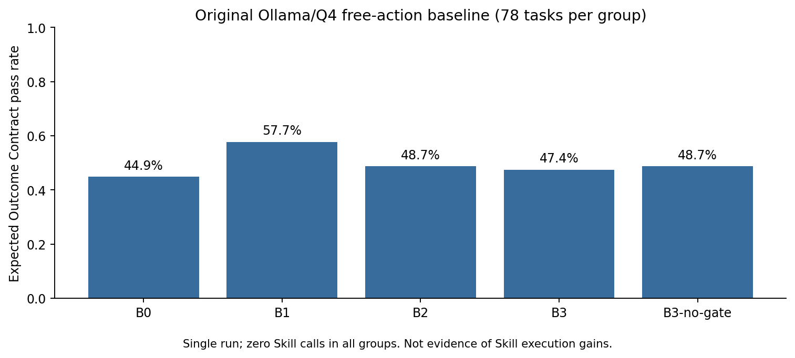
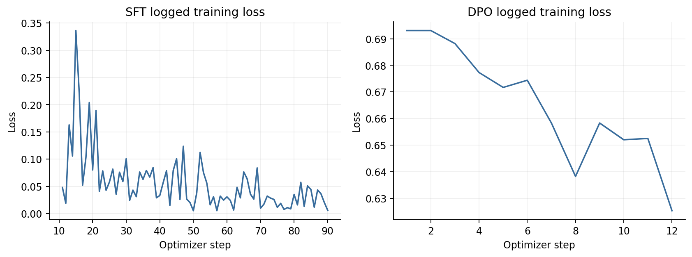
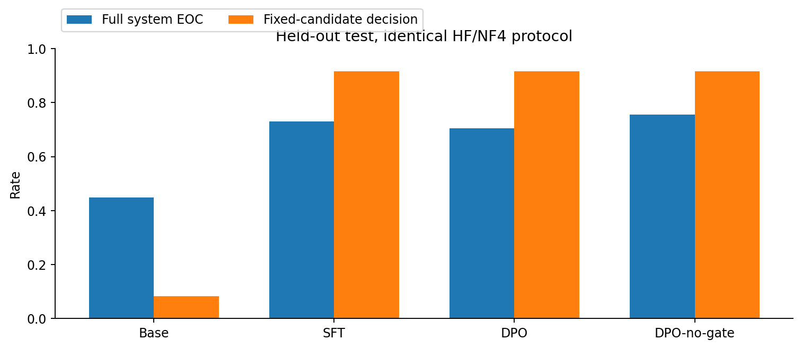

# SkillForge 实验与技术报告

生成时间：2026-09-18T11:52:42+02:00

本报告由实际结果文件生成，来源文件哈希另存于同目录的 RESEARCH_REPORT.sources.json。合成领域、单一随机种子，描述性结果不等于显著性或真实业务泛化。

## 研究问题与实现

研究对象是带适用边界的可执行技能，以及模型对技能、拒绝和转人工的选择。有限DSL支持call/assert/finish；Gate返回APPLICABLE/INAPPLICABLE/UNKNOWN，补查成本计入工具与延迟。Tool在事务内检查身份和业务policy，并保存mutation幂等记录。Expected Outcome Contract独立约束最终结局、状态与必要证据。

技能边界使用train成功轨迹、失败轨迹和business policy，validation完成准入及最多两轮领域修订。冻结数据集有69 train、69 validation、78 test，包含test独占组合结构，仍不构成开放域泛化证明。

## 后训练之前的真实基线

| 组别 | 任务数 | EOC合格率 | Skill尝试 | 实际违规率 |
|---|---|---|---|---|
| B0 | 78 | 44.9% | 0 | 0.0% |
| B1 | 78 | 57.7% | 0 | 0.0% |
| B2 | 78 | 48.7% | 0 | 0.0% |
| B3 | 78 | 47.4% | 0 | 0.0% |
| B3-no-gate | 78 | 48.7% | 0 | 0.0% |

原始自由Action组实际Skill调用均为0，不能从这些数字推导执行复用收益。B3自动Gate可提供额外观察，因此系统变化不必来自Skill执行。受限目录的27个validation及6个网页验收是另一协议，不混入此表。

## 训练数据与正式权重

真实轨迹筛出181个动作目标但没有Skill目标；独立标注的确定性契约教师提供186个目标，合并去重355个SFT例子，其中33个Skill动作。135个同上下文、同SQLite快照执行分支形成90对DPO偏好。教师llm_calls=0，不冒充真实模型成绩。validation另外冻结141个目标，只用于likelihood，不进入优化数据。

基座revision：`1cfa9a7208912126459214e8b04321603b3df60c`。NF4 double quant、BF16、LoRA r=8、alpha=16、batch=1、gradient accumulation=8、seed=42。SFT为2轮，DPO为1轮。

| 阶段 | 最终步数 | Trainer loss | 峰值allocated | 实际权重更新 |
|---|---|---|---|---|
| SFT | 90 | 0.04974 | 6.74 GB | True |
| DPO | 12 | 0.66520 | 8.59 GB | True |

SFT曲线仅包含当前运行保存的日志，恢复前步骤不虚构补点。Trainer汇总loss与验证token加权loss不是同一口径；SFT和DPO目标不同，二者loss不能横向作为模型优劣。显存为PyTorch峰值allocated，不是整机占用。

## 已完成的独立验证

| 模型 | 任务数 | EOC合格率 | 决策准确率 | Skill尝试 | 验证token loss |
|---|---|---|---|---|---|
| Base | 69 | 50.7% | 6.7% | 0 | 0.6650 |
| SFT | 69 | 87.0% | 93.3% | 16 | 0.0264 |
| DPO | 69 | 91.3% | 91.1% | 19 | 0.0266 |

仅展示本组全部完成且经逐条检查点重算审核的validation。缺席模型仍在运行或尚未完成；本表不替代最终test。

## 同协议后训练独立测试

Base/SFT/DPO共享HF/NF4/cuDNN、自由Action、verified Skills及任务集。Base是相同技能上下文中的未微调模型，不能与原Ollama B0当成同一控制条件。

| 模型 | EOC合格率 | 决策准确率 | Skill尝试 | 适用精度 | 模型违规尝试 | 实际违规 | 验证loss |
|---|---|---|---|---|---|---|---|
| Base | 44.9% | 8.3% | 0 | 未定义 | 20.5% | 0.0% | 0.6650 |
| SFT | 73.1% | 91.7% | 12 | 100.0% | 1.3% | 0.0% | 0.0264 |
| DPO | 70.5% | 91.7% | 12 | 100.0% | 1.3% | 0.0% | 0.0266 |
| DPO-no-gate | 75.6% | 91.7% | 25 | 32.0% | 14.1% | 0.0% | 0.0266 |

### 同任务配对变化

| 模型 | Base失败→成功 | Base成功→失败 |
|---|---|---|
| Base | 0 | 0 |
| SFT | 26 | 4 |
| DPO | 24 | 4 |
| DPO-no-gate | 30 | 6 |

这些是相同任务上的描述性变化，不是因果NTR或显著性检验。

### A–E分层

| 模型 | 层级 | 数量 | EOC合格率 |
|---|---|---|---|
| Base | A | 18 | 22.2% |
| Base | B | 27 | 77.8% |
| Base | C | 9 | 0.0% |
| Base | D | 12 | 25.0% |
| Base | E | 12 | 58.3% |
| SFT | A | 18 | 77.8% |
| SFT | B | 27 | 85.2% |
| SFT | C | 9 | 0.0% |
| SFT | D | 12 | 83.3% |
| SFT | E | 12 | 83.3% |
| DPO | A | 18 | 72.2% |
| DPO | B | 27 | 85.2% |
| DPO | C | 9 | 0.0% |
| DPO | D | 12 | 75.0% |
| DPO | E | 12 | 83.3% |
| DPO-no-gate | A | 18 | 94.4% |
| DPO-no-gate | B | 27 | 88.9% |
| DPO-no-gate | C | 9 | 0.0% |
| DPO-no-gate | D | 12 | 91.7% |
| DPO-no-gate | E | 12 | 58.3% |

### 按任务领域分层

| 模型 | 领域 | 数量 | EOC合格率 |
|---|---|---|---|
| Base | cancel_order | 15 | 40.0% |
| Base | composite | 9 | 0.0% |
| Base | modify_address | 30 | 63.3% |
| Base | refund | 18 | 33.3% |
| Base | shipment_investigation | 3 | 100.0% |
| Base | ticket | 3 | 33.3% |
| SFT | cancel_order | 15 | 93.3% |
| SFT | composite | 9 | 0.0% |
| SFT | modify_address | 30 | 90.0% |
| SFT | refund | 18 | 55.6% |
| SFT | shipment_investigation | 3 | 100.0% |
| SFT | ticket | 3 | 100.0% |
| DPO | cancel_order | 15 | 93.3% |
| DPO | composite | 9 | 0.0% |
| DPO | modify_address | 30 | 90.0% |
| DPO | refund | 18 | 44.4% |
| DPO | shipment_investigation | 3 | 100.0% |
| DPO | ticket | 3 | 100.0% |
| DPO-no-gate | cancel_order | 15 | 100.0% |
| DPO-no-gate | composite | 9 | 0.0% |
| DPO-no-gate | modify_address | 30 | 73.3% |
| DPO-no-gate | refund | 18 | 88.9% |
| DPO-no-gate | shipment_investigation | 3 | 100.0% |
| DPO-no-gate | ticket | 3 | 100.0% |

### 执行成本

| 模型 | 平均工具数 | 平均Gate读取 | 平均LLM调用 | 平均tokens | 平均秒数 |
|---|---|---|---|---|---|
| Base | 5.32 | 2.47 | 3.58 | 10324 | 19.40 |
| SFT | 6.08 | 2.46 | 3.63 | 11291 | 26.01 |
| DPO | 5.71 | 2.46 | 3.27 | 9860 | 23.32 |
| DPO-no-gate | 4.33 | 0.00 | 3.88 | 13147 | 26.52 |

工具成本包括Gate补查和Skill内部调用；延迟是本机串行测量，不将不同后端、硬件的耗时直接归因于算法。

### 结局与失败分析

| 诊断 | Base | SFT | DPO | DPO-no-gate |
|---|---|---|---|---|
| wrong_tool | 0 | 0 | 0 | 0 |
| wrong_arguments | 0 | 0 | 0 | 0 |
| wrong_skill | 0 | 0 | 0 | 0 |
| policy_violation | 0 | 0 | 0 | 0 |
| premature_stop | 25 | 8 | 11 | 5 |
| failure_to_stop | 0 | 0 | 0 | 0 |
| missing_verification | 24 | 8 | 11 | 5 |
| tool_error_not_recovered | 0 | 0 | 0 | 0 |
| insufficient_information | 0 | 0 | 0 | 16 |
| max_steps_exceeded | 0 | 5 | 4 | 0 |
| model_format_error | 1 | 0 | 0 | 0 |
| wrong_outcome | 19 | 13 | 12 | 14 |
| wrong_reuse_associated_failure | 0 | 0 | 0 | 0 |
| unnecessary_continuation | 0 | 0 | 0 | 0 |

补充诊断按任务计数、允许重叠，依据已执行证据生成，不改原始verdict。tool_error_not_recovered在本表要求最终EOC失败；failure_to_stop仅在非复合任务已验证Skill成功后仍继续调用并耗尽预算时标记。wrong_reuse_associated_failure是关联，因果negative_transfer仍为null。

**Base**：观察到的结局 `{"completed": 25, "refused": 34, "escalated": 18, "error": 1}`；符合EOC的结局 `{"refused": 20, "escalated": 15}`。

错误分类：`{"missing_verification": 24, "premature_stop": 25, "policy_violation_attempt": 16, "tool_error_not_recovered": 3, "not_found": 1, "model_or_runtime_error": 1}`。

| 失败任务 | 领域 | 原因 |
|---|---|---|
| task-80544b2a08bd57e8e768 | modify_address | missing_verification, missing_verification, premature_stop |
| task-673dbc9dd8f247601722 | modify_address | missing_verification, missing_verification, premature_stop |
| task-ed359ba55106b09d8847 | modify_address | missing_verification, missing_verification, premature_stop |
| task-dc45c35c4539665fa28a | modify_address | unexpected_outcome, policy_violation_attempt |
| task-7e2db9056f851620b578 | modify_address | unexpected_outcome, policy_violation_attempt |

上表为任务顺序中的前5个失败示例，完整失败清单保留在comparison.json，未按表现挑选。

**SFT**：观察到的结局 `{"completed": 23, "refused": 26, "escalated": 24, "max_steps_exceeded": 5}`；符合EOC的结局 `{"completed": 15, "refused": 18, "escalated": 24}`。

错误分类：`{"policy_violation_attempt": 1, "max_steps_exceeded": 5, "missing_verification": 8, "premature_stop": 8}`。

| 失败任务 | 领域 | 原因 |
|---|---|---|
| task-7e2db9056f851620b578 | modify_address | unexpected_outcome, max_steps_exceeded |
| task-5d8affbfbc38c6af2a55 | cancel_order | missing_verification, missing_verification, premature_stop |
| task-aa38b5523e6289961272 | refund | missing_verification, missing_verification, premature_stop |
| task-c50d95cdd2eabf3b7e52 | refund | unexpected_outcome, expected:payment.refunded_amount, max_steps_exceeded |
| task-c1422229a8352e1cf4fc | refund | missing_verification, missing_verification, premature_stop |

上表为任务顺序中的前5个失败示例，完整失败清单保留在comparison.json，未按表现挑选。

**DPO**：观察到的结局 `{"completed": 24, "refused": 26, "escalated": 24, "max_steps_exceeded": 4}`；符合EOC的结局 `{"completed": 13, "refused": 18, "escalated": 24}`。

错误分类：`{"policy_violation_attempt": 1, "max_steps_exceeded": 4, "missing_verification": 11, "premature_stop": 11}`。

| 失败任务 | 领域 | 原因 |
|---|---|---|
| task-7e2db9056f851620b578 | modify_address | unexpected_outcome, max_steps_exceeded |
| task-5d8affbfbc38c6af2a55 | cancel_order | missing_verification, missing_verification, premature_stop |
| task-d71f713e079ab5c2b330 | refund | missing_verification, missing_verification, premature_stop |
| task-aa38b5523e6289961272 | refund | missing_verification, missing_verification, premature_stop |
| task-45334e54e1889ab54a6c | refund | missing_verification, missing_verification, premature_stop |

上表为任务顺序中的前5个失败示例，完整失败清单保留在comparison.json，未按表现挑选。

**DPO-no-gate**：观察到的结局 `{"completed": 24, "escalated": 25, "refused": 29}`；符合EOC的结局 `{"completed": 19, "refused": 18, "escalated": 22}`。

错误分类：`{"policy_violation_attempt": 5, "tool_error_not_recovered": 3, "missing_verification": 5, "premature_stop": 5}`。

| 失败任务 | 领域 | 原因 |
|---|---|---|
| task-292ef81ae14a36c27b3f | modify_address | unexpected_outcome |
| task-5a00f3a9d86cd9d6c54d | modify_address | unexpected_outcome |
| task-3b9ce844f270fdf7774d | modify_address | unexpected_outcome |
| task-bdd32dbdec43e2d790e2 | modify_address | unexpected_outcome |
| task-abd88aed3619fa1f2adb | modify_address | unexpected_outcome |

上表为任务顺序中的前5个失败示例，完整失败清单保留在comparison.json，未按表现挑选。

## 重复执行稳定性

| 模型 | 固定任务数 | 次数 | 三次全部合格 | 结局一致率 |
|---|---|---|---|---|
| Base | 12 | 3 | 41.7% | 100.0% |
| SFT | 12 | 3 | 83.3% | 100.0% |
| DPO | 12 | 3 | 75.0% | 100.0% |

预先按三类primitive Skill×A/B/D/E各选task ID字典序首个任务，共12个；主test为第1次，额外2次独立环境。相同greedy设置，无抽样种子变化，属于描述性重复稳定性，不是pass@k或独立随机试验。

## 复现与限制

- 运行 `python -m scripts.run_training_pipeline` 恢复流水线；已有活跃流水线时不要重复启动。
- 报告重建：`python -m scripts.write_research_report`；绘图依赖见requirements-report.txt。
- 训练与评测检查模型、语料、任务、配置和代码身份；已完成权重不无记录覆盖。
- 模型违规尝试、自动Gate尝试与实际违规分别解释；旧轨迹缺新归因字段时返回null。
- 当前是单种子、受限合成领域，缺少真实业务、多模型和大规模泛化验证。
- GPU评测串行执行，但期间存在CPU回归与文档工作；延迟是本机观察值，不是独占整机的严格性能基准。
- 不适用复用与失败的关联不是因果负迁移；无相应反事实证据时causal NTR保持null。
- 生产身份治理、外部支付幂等、多租户、高可用不在当前本地研究验收范围。
